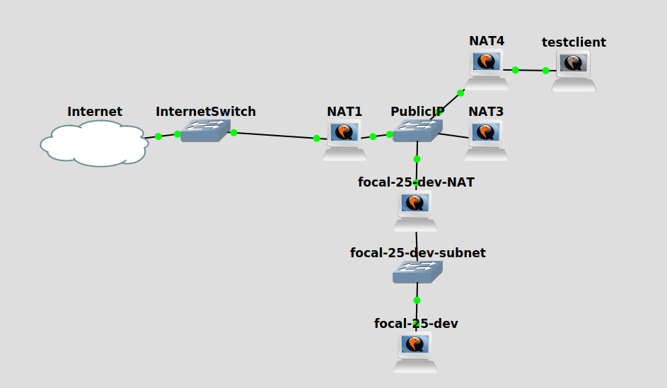

# GNS3-BBB

Scripts to build a virtual BigBlueButton network in a gns3 project (for testing purposes).

**Prerequisites:** a Ubuntu server with KVM (Kernel Virtual Machine) support and enough CPU and RAM to support the virtual machines in the virtual network

**Note**: gns3 is very picky about matching GUI client and server versions.  I typically put dpkg holds on the gns3 packages, since otherwise an apt upgrade on my laptop requires both an apt upgrade on my gns3 server *and* restarting the gns3 server, which implies stopping and restarting all of the running VMs.

**Note**: gns3 uses qemu, which	can not	run concurrently with VirtualBox.  If VirtualBox virtual machines are running. gns3 virtual machines will not start, and vice versa.

**Note:** Once the script has been used to build the virtual network (takes about an hour), the virtual network can be stopped and restarted without having to re-run the script.

## Design

The script will build a gns3 project that looks like this:



The network "highjacks" the 128.8.8.0/24 subnet, so it simulates public IP address space.  You can set a different public subnet using the `--public-subnet` option to the script.

The DNS domain name is configured to match the bare metal hostname.  If the bare metal machine is called `osito`, for example, the virtual machines will be given names like `BigBlueButton.osito` and `focal-260.osito`.

The `BigBlueButton` virtual machine (called `master_gateway` in the script) is named to match the gns3 project name, which is `BigBlueButton` by default.  The project name (and the name of the master gateway) can be changed using the `--project` option.

The master gateway, in addition to providing DNS and DHCP service for the 128.8.8.0/24 subnet, also operates a STUN server that presents itself in DNS as `stun.l.google.com`, so that STUN operations, on both the BigBlueButton clients and servers, yield the 128.8.8.0/24 addresses as public addresses.  `BigBlueButton` also operates an ACME CA signing service (so that `certbot` works), and mimics `resolver1.opendns.com` (used by `bbb-install` to check that the server can reach itself).

The master gateway also announces the 128.8.8.0/24 subnet to the bare metal machine using OSPF, and implements NAT, so that the bare metal machine can connect to the virtual servers.

The `focal-260-NAT` device announces itself into DHCP/DNS as `focal-260.DOMAIN` and forwards ports 80 and 443 (along with UDP ports) through to `focal-260` itself.  Clients can therefore connect to `focal-260.DOMAIN`, just as they would to a typical BBB server.  The NAT device itself listens for ssh on port 2222.  The `--no-nat` option can be specified to create a server without an associated NAT gateway.

Default operation of the script is to install a server whose name is passed into the script and is used both as the hostname of the server and as the release name to install.  Obvious server names include `focal-250`, `focal-25-dev`, and `focal-260`.  You can specify the `-r`/`--repository` option to use a repository other than `ubuntu.bigbluebutton.org` (just like the install script).  The `--install-script` option allows an alternate install script to be used.

Some special names are defined.  Requesting a device name starting with `testclient` creates a test client that connects to NAT4 (overlapping server address space), NAT5 (private address not overlapping server address space), and NAT6 (carrier grade NAT).  Likewise, `turn` and `natturn` devices can also be created, just by requesting them by name.

## Usage

1. You'll need several tools from Brent Baccala's NPDC repository on github, so run this command to fetch it:

   ```
   ./NPDC.placeholder.sh
   ```

1. Read, understand, and run the `install-gns3.sh` script in `NPDC/GNS3`

1. Upload a current Ubuntu 20 cloud image to the gns3 server using NPDC's `GNS3/upload-image.py`:

   `./upload-image.py https://cloud-images.ubuntu.com/releases/focal/release/ubuntu-20.04-server-cloudimg-amd64.img`

   The most uncommon Python3 package that this script uses is `python3-requests-toolbelt`.  `python3-clint` is also recommended, to get a progress bar.

   If this step works, then you have REST API access to the GNS3 server.

1. You should now be able to boot an Ubuntu instance with this `NPDC/GNS3` script:

   `./ubuntu.py -r 20 -m 1024 --debug`

   Double-click on the icon that appears in the GUI to access the instance's console.  You should also be able to login using `ssh ubuntu`.

   The `--debug` option adds a login with username `ubuntu` and password `ubuntu`.

   Login and verify, in particular, that networking is working properly.  You should have Internet access.

1. Finally, build the BigBlueButton project in gns3 with `./gns3-bbb.py`

1. Install a server with `./gns3-bbb.py --wait-all focal-260`

   The `--wait-all` option will cause the script to wait for BigBlueButton to install while you watch.  Without this option, the script will pause to wait for the NAT device to boot before starting the BigBlueButton server, then terminate once the BigBlueButton server has begun its install sequence.

1. You can run tests directly from the bare metal machine.  The script created an SSL certificate in its own directory called `bbb-dev-ca.crt` which can be installed and trusted on your web browser.
1. Add another server with `./gns3-bbb.py focal-250`
1. Remove a server and its associated NAT gateway and switch with `./gns3-bbb.py --delete focal-250`

1. `ssh` into the server devices directly.

1. You can `ssh` into a server's NAT gateway with `ssh -p 2222 focal-260`.

1. Since test servers come and go fairly frequently, I find the following stanza useful in my `.ssh/config`:

   ```
   Host BigBlueButton NAT? testclient* focal-*
     User ubuntu
     UserKnownHostsFile /dev/null
     StrictHostKeyChecking no
   ```

   This stops `ssh` from complaining about server host keys changing, which happens every time you delete and rebuild a server.

### Installing test clients

1. Build a GUI image using NPDC's `GNS3/ubuntu.py`:

   `./ubuntu.py -r 20 -s $((1024*1024)) -m 1024 --boot-script opendesktop.sh --gns3-appliance`

   This step adds the GUI packages to the Ubuntu 20 cloud image and creates a new cloud image used for the test clients. It takes about half an hour.

1. Upload the resulting GUI image to the gns3 server using NPDC's `GNS3/upload-image.py`

1. Add a test client with `./gns3-bbb.py testclient`

1. You can access a testclient's GUI by double-clicking on its icon in the GNS3 GUI.

1. You can `ssh` into a testclient by specifying its NAT gateway as a jump host (`-J`) option to ssh: `ssh -J NAT4 testclient`

### Possible Test Environments

1. UDP ports can be blocked, forcing use of TURN, like this (blocks all servers from bare metal clients):

   ```
   $ ssh BigBlueButton
   ubuntu@BigBlueButton:~$ sudo iptables -A FORWARD -p udp -j REJECT
   ```

   or like this (blocks one server from all clients):

   ```
   $ ssh -p 2222 focal-260
   ubuntu@focal-260-NAT:~$ sudo iptables -A FORWARD -p udp -j REJECT
   ```

2. Install a proxy on BigBlueButton and force its use by blocking TCP traffic?  (bbb-install issue #583)
