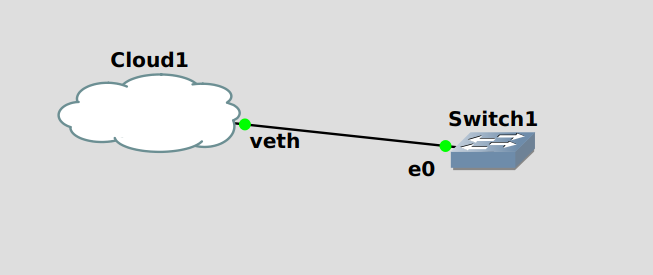

# GNS3-BBB

Scripts to build a virtual BigBlueButton network in a gns3 project (for testing purposes).

**Prerequisites:** a Ubuntu server with enough CPU and RAM to support the virtual machines in the virtual network

**Note**: gns3 is very picky about matching GUI client and server versions.  I typically put dpkg holds
on the gns3 packages, since otherwise an apt upgrade on my laptop requires both an apt upgrade on my
gns3 server *and* restarting the gns3 server, which implies stopping and restarting all of the running VMs.

**Note:** Once the script has been used to build the virtual network (takes about an hour), the virtual network can be stopped
and restarted without having to re-run the script.

## Design

The script will build a gns3 project that looks like this:


The `PublicIP` switch operates using the 128.8.8.0/24 subnet, so it simulates public IP address space.

The `NAT1` device, in addition to providing DNS and DHCP service for the 128.8.8.0/24 subnet, also
operates a STUN server on 128.8.8.254 that presents itself in DNS as `stun.l.google.com`, so that
STUN operations, on both the BigBlueButton clients and servers, yield the 128.8.8.0/24 addresses
as public addresses.  `NAT1` also operates an SSL CA signing service via HTTP CGI.

The `focal-25-dev-NAT` device announces itself into NAT1's DHCP/DNS as `focal-25-dev.test` and forwards
ports 80 and 443 (along with UDP ports) through to `focal-25-dev` itself.
Clients can therefore connect to `focal-25-dev.test`, just as they would to a typical BBB server.

Current server options are `bionic-240`, `focal-250`, `focal-25-dev`, and `focal-260`.

The `testclient` can be moved around the network.  Connect to either NAT3 (overlapping server address space),
NAT4 (private address not overlapping server address space), directly to PublicIP (client with a public IP address),
or directly to `focal-25-dev-subnet` (client on same private network as server).

## Usage

1. gns3 is not in the standard Ubuntu distribution, but the gns3 team maintains an Ubuntu Personal Package Archive (PPA),
   which can be added like this:

   `sudo add-apt-repository ppa:gns3`

1. On the server, `sudo apt install gns3-server`

1. Configure gns3-server to start on boot (if desired) by adding a `gns3` user.  The virtual machine images
   and disk files (which can grow quite large) are then stored in `/home/gns3/GNS3`.
   - `sudo adduser gns3`
   - gns3 requires permission to use Kernel Virtual Machines and ubridge

      ```
     sudo adduser gns3 kvm
     sudo adduser gns3 ubridge
      ```
   - Enable gns3's systemd user services to start on boot

      `sudo loginctl enable-linger gns3`

   - Append to /home/gns3/.bashrc (so that systemctl works even if you don't login with the GUI):
      ```
      export XDG_RUNTIME_DIR=/run/user/$(id -u)
      ```
   - Add the following file as `/home/gns3/.config/systemd/user/gns3.service`:
      ```
      [Unit]
      Description=GNS3 server

      [Service]
      Type=simple
      ExecStart=/usr/bin/gns3server

      [Install]
      WantedBy=default.target
      ```
   - Configure authentication into gns3 with `/home/gns3/.config/GNS3/2.2/gns3_server.conf`:
      ```
      [Server]
      auth = True
      user = gns3
      password = PASSWORD
      ```
   - While su'ed to `gns3`, enable and start the gns3 server:
     ```
     systemctl --user enable gns3
     systemctl --user start gns3
     ```

1. Install the gns3 GUI: `sudo apt install gns3-gui`

1. You should now be able to start the gns3 GUI and access the gns3 server.  Select "Run applications on a remote server"
   and use the credentials (gns3/PASSWORD) set above to access it.

   I think you want "Run applications on a remote server" even if you're running the server on your local machine,
   because the `gns3-bbb.py` script needs access to the server's REST API.

3. Configure Internet network access to the gns3 virtual network.
   How to do this exactly is beyond the scope of this README.
   Internet access is required since the virtual devices need to download Internet packages during installation.

   Can be either routed or bridged.  For a routed configuration, add the following file as `/etc/systemd/system/veth.service`:
   ```
   [Unit]
   Description=Configure virtual ethernet for GNS3
   After=network.target
   Before=isc-dhcp-server.service

   [Service]
   Type=oneshot
   ExecStart=/sbin/ip link add dev veth type veth peer name veth-host
   ExecStart=/sbin/ip link set dev veth up
   ExecStart=/sbin/ip link set dev veth-host up
   ExecStart=/sbin/ip addr add 192.168.8.1/24 broadcast 192.168.8.255 dev veth-host
   ExecStart=/sbin/ethtool -K veth-host tx off

   [Install]
   WantedBy=multi-user.target
   ```
   - `sudo systemctl enable veth`
   - `sudo systemctl start veth`
   - You should now be able to `ping 192.168.8.1`
   - `sudo apt install isc-dhcp-server`
   - Add something like the following snippet to `/etc/dhcp/dhcpd.conf` to enable DHCP
     service on the virtual subnet:
      ```
      subnet 192.168.8.0 netmask 255.255.255.0 {
        range 192.168.8.129 192.168.8.199;
        option routers 192.168.8.1;
      }
      ```
   - Also in `/etc/dhcp/dhcpd.conf`, set `domain-name-servers` to your local DNS servers.

     They can be found by looking at the output of `resolvectl`.

     This would ideally be done automatically
   - You may also want to set `domain-name` in that same file to your local DNS name.
   - `sudo systemctl enable isc-dhcp-server`
   - `sudo systemctl start isc-dhcp-server`
   - Modify `/etc/sysctl.conf` to enable packet forwarding:
      ```
      # Uncomment the next line to enable packet forwarding for IPv4
      net.ipv4.ip_forward=1
      ```
   - If you want to access the virtual network devices from other machines, you'll need to
     adjust your network configuration to route traffic for the virtual subnet to the machine.

     How to do this is beyond the scope of this README.

   - If you don't want to access the virtual network devices from other machines, you can
     configure the machine to act as a NAT gateway, like this:

     `sudo iptables -t nat -A POSTROUTING -s 192.168.8.0/24 -j MASQUERADE`

   - If you configure NAT, the following commands will make that change persist over reboots:

     `sudo apt install iptables-persistent`

1. Configure authentication to gns3-server in either `~/gns3_server.conf` or `~/.config/GNS3/2.2/gns3_server.conf`:
   ```
   host = localhost
   port = 3080
   ```

   If you used the gns3 GUI to test access to the server, it's likely you already have a suitable
   `~/.config/GNS3/2.2/gns3_server.conf`.

1. You'll need several tools from Brent Baccala's NPDC repository on github
   ```
   git clone https://github.com/BrentBaccala/NPDC
   ```
1. Download a current Ubuntu 20 cloud image from Canonical:

   `wget https://cloud-images.ubuntu.com/releases/focal/release/ubuntu-20.04-server-cloudimg-amd64.img`

1. Upload to the gns3 server using NPDC's `GNS3/upload-image.py`:

   `./upload-image.py ubuntu-20.04-server-cloudimg-amd64.img`

   The most uncommon Python3 package that this script uses is `python3-requests-toolbelt`

   If this step works, then you have REST API access to the GNS3 server.

1. Use the gns3 GUI to create the project "Virtual Network", and build it like this:

   

   You will need to configure the cloud, enable `show special Ethernet interfaces`, and add `veth` to the available interfaces.

1. You should now be able to boot an Ubuntu instance like this:

   `./ubuntu.py -r 20 -m 1024 --debug`

   Double-click on the icon that appears in the GUI to access the instance's console.

   The `--debug` option adds a login with username `ubuntu` and password `ubuntu`.

   Login and verify, in particular, that networking is working properly.  You should have Internet access.

1. Build a GUI image using NPDC's `GNS3/ubuntu.py`:

   `./ubuntu.py -r 20 -s $((1024*1024)) -m 1024 --boot-script opendesktop.sh --gns3-appliance`

   This step adds the GUI packages to the Ubuntu 20 cloud image and creates a new cloud image used for the test clients.
   It takes about half an hour.

1. Upload the GUI image to the gns3 server using NPDC's `GNS3/upload-image.py`
1. Set network interface name and GUI image name in `gns3-bbb.py`
1. Finally, build the BigBlueButton project in gns3 with `./gns3-bbb.py focal-25-dev`

   This script will pause to trigger each gateway device booting in sequence,
   and terminate once the BigBlueButton server and the test client have begun their install sequences.

1. Add a test client with `./gns3-bbb.py testclient`
1. Add another server with `./gns3-bbb.py focal-260`

1. `ssh` into these devices using the `-J` or `ProxyJump` option, something like this (in `.ssh/config`):

```
Host focal-25-dev
  Hostname 192.168.1.2
  User ubuntu
  ProxyJump ubuntu@192.168.4.165, ubuntu@128.8.8.150
```

1. For the brave: rather than figuring out the `ProxyJump` options by hand,
   source `bigbluebutton-ssh.sh` to use a shell function for `ssh` and `scp` that finds them automatically.

   You will need to set `NAT1` in that file to the IP address of `NAT1`.
