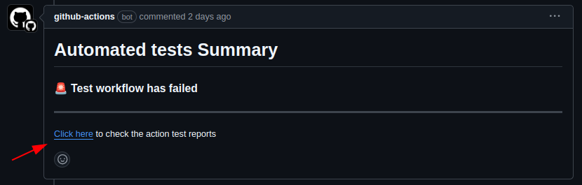
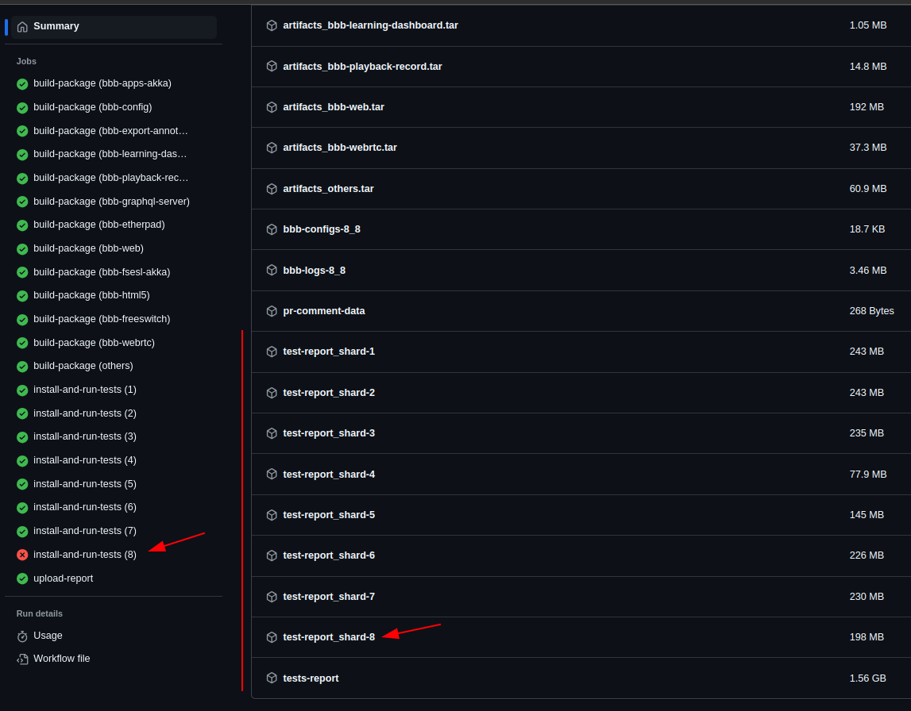

## BigBlueButton Playwright Tests

Tests for BigBlueButton using Playwright.

## Setup (with an existing BigBlueButton server)

You need to install the dependencies:
```bash
$ cd ../bigbluebutton-tests/playwright
$ npm install
$ npx playwright install
```
You may also need to run the following command:
```bash
$ npx playwright install-deps
```
To run these tests with an existing BigBlueButton server, you need to find the server's URL and secret (can be done with `bbb-conf --secret` command). You need to put them into the `.env` file inside `bigbluebutton-tests/playwright` folder (variables `BBB_URL` and `BBB_SECRET`).

## Run tests

We recommend to use Node version 16 or higher to avoid errors in JavaScript.
Tests can be executed using `npx` and `npm test`. You can run all tests in each of 3 supported environments (`chromium`, `firefox`, `webkit`) with one of the following commands:
```bash
$ npx playwright test
or
$ npm test
```

You can also run a single test suite and limit the execution to only one browser:
```bash
$ npx playwright test chat --project="firefox"
or
$ npm test chat -- --project="firefox" # or "chromium" for example
```

### Npm-scripts parameters

Run fully parallel mode:
```bash
$ npm test chat --parallel -- --project chromium
```

### Additional commands

To see the tests running visually, you must run them in headed mode:
```bash
$ npm run test:headed chat
```

If you want to run a specific test or a specific group of tests, you can do so with the following command:
```bash
$ npm run test:filter "Send public message"
```
_(note that this filter needs to be passed in "double quotes")_

You can also use this also through the test tree, adding the test suite / group of tests before the test filter:
```bash
$ npm run test:filter "notifications chat"
```

If you don't have `BBB_URL` and `BBB_SECRET` set, but have ssh access to the test server, you can use the following command to obtain `BBB_URL` and `BBB_SECRET` via ssh:

```bash
$ npm run test:ssh -- HOSTNAME
```

## Recording Meteor messages

A modified version of `websockify` can be used to record the Meteor messages exchanged between client and server, by inserted a WebSocket proxy between the client and server, configured to record the sessions.

First, on the server, obtain the modified `websockify`:

```bash
git clone https://github.com/BrentBaccala/websockify.git
```

Install additional dependencies:

```bash
sudo apt install python3-numpy
```

Then add the following stanza to `/usr/share/bigbluebutton/nginx/bbb-html5.nginx`:

```
location ~* /html5client/.*/websocket {
  proxy_pass http://127.0.0.1:4200;
  proxy_http_version 1.1;
  proxy_set_header Upgrade $http_upgrade;
  proxy_set_header Connection "Upgrade";
}
```

From the `websockify` directory, run `websockify` configured to proxy WebSocket connections from port 4200 to port 4100, recording the sessions to files named `bbb.1`, `bbb.2`, etc.:

```bash
./run -v --record=bbb --ws-target=ws://localhost:4100{path} 4200
```

Now reload nginx:

```bash
sudo systemctl reload nginx
```

Meteor messages for Big Blue Button sessions will now be recorded for later review.

It doesn't seem necessary to relay cookies, but that could be done by giving a `--ws-relay-header=Cookie` argument to `websockify`.

## Print browser logs

You can print the browser console log to standard output by setting the environment variable `CONSOLE`:

```
$ CONSOLE= npm test chat -- --project=firefox
```

`CONSOLE` can be blank (as in the example), or can be a comma-separated list of the following options:

| Option | Meaning |
| ------ | ------- |
| color  | (or "colour") colorize the output |
| label  | label each line with the BigBlueButton user |
| norefs | remove JavaScript reference URLs |
| nots   | remove timestamps |
| nocl   | remove "clientLogger:" strings |

## Check test results

After opening a PR, the CI will run automated tests within your changes + target branch merged. When it finishes testing, generated files of the execution are exposed to be downloaded in the action run tab. the files / data is used mostly for exploring failures. To check the test results locally:

- Go to the action run link (or simply click on the link in the bot's PR comment)



- Scroll down until you see `test-report` artifacts. You can choose downloading **all** data or only the shard data that contains tests failing for a faster download (named `test-reports_shard-<SHARD-NUMBER>`):



- Click to download and extract the content, preferably, in a folder that already has Playwright installed. You can do it in the `bigbluebutton/bigbluebutton-tests/playwright` folder with the dependencies installed ([see Setup instructions](#setup-with-an-existing-bigbluebutton-server))

  - We suggest the folder to be named with the prefix `test-results` or `pr-` as it will be ignored by git

- Run the following command to serve up the reported files:
  - you might want to use it in a different port than the default `9323`. use `--port <PORT>` then

```sh
$ npx playwright show-report <results-folder-name>
```
- Access the logged URL to check the test report (if needed, check the [Playwright official documentation](https://playwright.dev/docs/trace-viewer-intro#opening-the-html-report))
