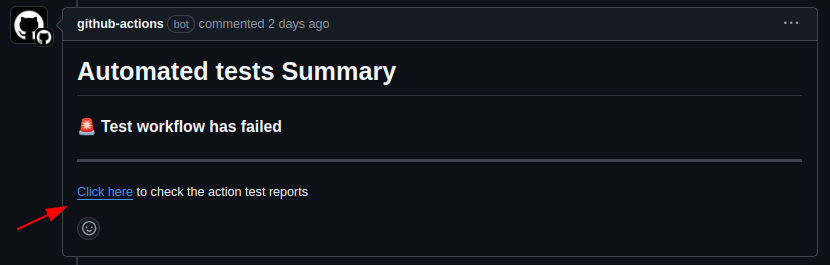
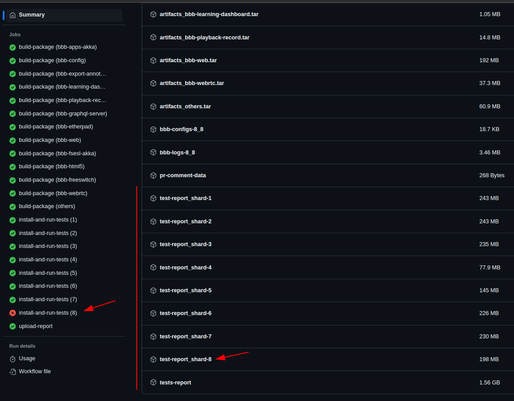

<!-- omit from toc -->

## BigBlueButton Playwright Tests

Tests for BigBlueButton using Playwright.

<!-- omit from toc -->

## Table of content

- [Setup](#setup)
  - [1. Install dependencies](#1-install-dependencies)
  - [2. Run tests](#2-run-tests)
    - [2.1. Additional commands](#21-additional-commands)
    - [2.2. Useful parameters](#22-useful-parameters)
- [Skip SDK tests without the need of a new release](#skip-sdk-tests-without-the-need-of-a-new-release)
- [Recording Meteor messages](#recording-meteor-messages)
- [Print browser logs](#print-browser-logs)
- [Code Formatting and Linting](#code-formatting-and-linting)
  - [Available Commands](#available-commands)
  - [Pre-commit Hooks](#pre-commit-hooks)
  - [Editor Integration](#editor-integration)
- [Check test results of a pull request](#check-test-results-of-a-pull-request)

## Setup

This section assumes a BigBlueButton server is already configured. Ideally the tests should be run in a separate environment

### 1. Install dependencies

```bash
cd ./bigbluebutton-tests/playwright
npm install
npx playwright install
npx playwright install-deps
```

To run these tests with an existing BigBlueButton server, you need to find the server's URL and secret (can be done with `bbb-conf --secret` command). You need to set them into the `.env` file inside `bigbluebutton-tests/playwright` folder (variables `BBB_URL` and `BBB_SECRET` - check in `.env.template`).

### 2. Run tests

- **IMPORTANT**: BBB automated tests rely on the default server config (based on values set in `settings.yml`). Any custom setting may cause false failures.
- Node 20+ recommended to avoid errors in JavaScript.

Tests can be executed using `npx playwright test` or `npm test`. You can run all tests in each of 3 available browsers (`chromium`, `firefox`, `webkit`) (Note: ensure the browser you're interested in is enabled in `playwright.config.ts`) with one of the following commands:

```bash
npx playwright test
```

or

```bash
npm test
```

_**NOTE**: Current support for BBB tests using `firefox` and `webkit` is limited. Expected that tests will fail even if the functionality is working correctly_

You can also run a single test suite and limit the execution to only one browser:

```bash
npx playwright test chat --project="chromium"
```

or

```bash
npm test chat -- --project="chromium" # or "firefox" for example
```

#### 2.1. Additional commands

- To see generated reports of the last test run:

```bash
npx playwright show-report
```

- To see the tests running visually, you must run them in headed mode:

```bash
npm run test:headed chat
```

- If you want to run a specific test or a specific group of tests, you can do so with the following command:

```bash
npm run test:filter "Send public message"
```

_Note: This filter needs to be passed in double quotes_

- You can also use this also through the test tree, adding the test suite / group of tests before the test filter:

```bash
npm run test:filter "notifications chat"
```

If you don't have `BBB_URL` and `BBB_SECRET` set, but have ssh access to the test server, you can use the following command to obtain `BBB_URL` and `BBB_SECRET` via ssh:

```bash
npm run test:ssh -- HOSTNAME
```

#### 2.2. Useful parameters

```bash
--list                  # list tests
--grep "lock viewers"   # filter test specs
--grep-invert "@flaky"  # inverted filter test specs (avoid matching)
--workers 2             # number of concurrent workers (amount of parallel tests)
--last-failed           # re-run only last failures
--repeat-each 3         # repeat each test
--retries               # maximum retry attempts before failing
```

_You can check the official documentation [here](https://playwright.dev/docs/test-cli)_

## Skip SDK tests without the need of a new release

Instead pushing changes with `@flaky` flag addition into the BigBlueButton SDK repository, you can simply add the flaky tests into `/bigbluebutton-tests/playwright/sdk-flaky-tests.txt` which will skip them on CI workflow runs (added on [this PR](https://github.com/bigbluebutton/bigbluebutton/pull/23656))

## Recording Meteor messages

A modified version of `websockify` can be used to record the Meteor messages exchanged between client and server, by inserted a WebSocket proxy between the client and server, configured to record the sessions.

First, on the server, obtain the modified `websockify`:

```bash
git clone https://github.com/BrentBaccala/websockify.git
```

Install additional dependencies:

```bash
sudo apt install python3-numpy
```

Then add the following stanza to `/usr/share/bigbluebutton/nginx/bbb-html5.nginx`:

```
location ~* /html5client/.*/websocket {
  proxy_pass http://127.0.0.1:4200;
  proxy_http_version 1.1;
  proxy_set_header Upgrade $http_upgrade;
  proxy_set_header Connection "Upgrade";
}
```

From the `websockify` directory, run `websockify` configured to proxy WebSocket connections from port 4200 to port 4100, recording the sessions to files named `bbb.1`, `bbb.2`, etc.:

```bash
./run -v --record=bbb --ws-target=ws://localhost:4100{path} 4200
```

Now reload nginx:

```bash
sudo systemctl reload nginx
```

Meteor messages for Big Blue Button sessions will now be recorded for later review.

It doesn't seem necessary to relay cookies, but that could be done by giving a `--ws-relay-header=Cookie` argument to `websockify`.

## Print browser logs

You can print the browser console log to standard output by setting the environment variable `CONSOLE`:

```bash
CONSOLE= npm test chat -- --project=firefox
```

`CONSOLE` can be blank (as in the example), or can be a comma-separated list of the following options:

| Option | Meaning                                     |
| ------ | ------------------------------------------- |
| color  | (or "colour") colorize the output           |
| label  | label each line with the BigBlueButton user |
| norefs | remove JavaScript reference URLs            |
| nots   | remove timestamps                           |

## Code Formatting and Linting

This project uses Prettier for code formatting and ESLint for linting. The configuration enforces a maximum line length of 120 characters and consistent code style.

### Available Commands

```bash
# Format all files
npm run format

# Check if files are properly formatted (useful for CI)
npm run format:check

# Run ESLint
npm run lint

# Run ESLint with automatic fixes
npm run lint:fix

# Type checking
npm run typecheck
```

### Pre-commit Hooks

The project uses Husky to run formatting checks and type checking before commits. This ensures that all committed code follows the established style guidelines.

### Editor Integration

For the best development experience, configure your editor to:

- Format on save using Prettier
- Show ESLint errors and warnings
- Auto-fix ESLint issues when possible

VSCode settings are provided in `.vscode/settings.json` for automatic formatting and linting.

## Check test results of a pull request

After opening a PR, the CI will run automated tests within your changes + target branch merged. When it finishes testing, generated files of the execution are exposed to be downloaded in the action run tab. the files / data is used mostly for exploring failures. To check the test results locally:

- Go to the action run link (or simply click on the link in the bot's PR comment)



- Scroll down until you see `test-report` artifacts. You can choose downloading **all** data or only the shard data that contains tests failing for a faster download (named `test-reports_shard-<SHARD-NUMBER>`):



- Click to download and extract the content, preferably, in a folder that already has Playwright installed. You can do it in the `bigbluebutton/bigbluebutton-tests/playwright` folder with the dependencies installed ([see Setup instructions](#setup-with-an-existing-bigbluebutton-server))
  - We suggest the folder to be named with the prefix `test-results` or `pr-` as it will be ignored by git

- Run the following command to serve up the reported files:
  - you might want to use it in a different port than the default `9323`. use `--port <PORT>` then

```sh
npx playwright show-report <results-folder-name>
```

- Access the logged URL to check the test report (if needed, check the [Playwright official documentation](https://playwright.dev/docs/trace-viewer-intro#opening-the-html-report))
