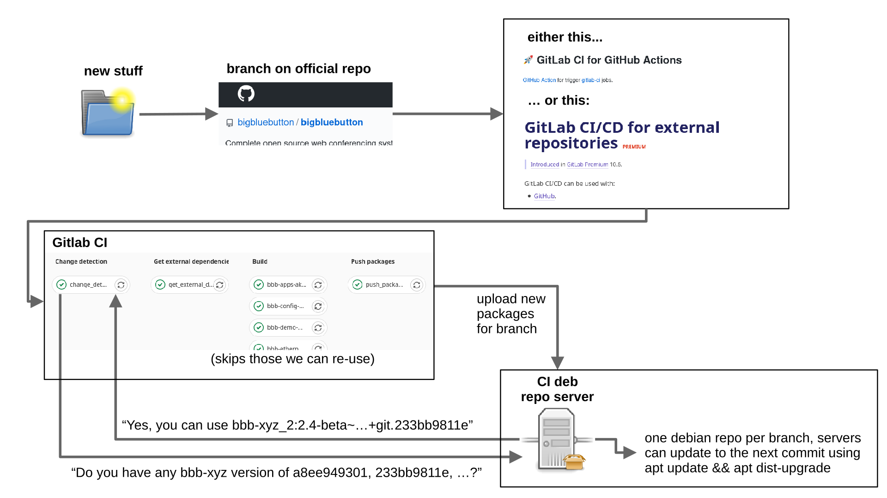

# build

build scripts for packaging bigbluebutton.

This directory contains scripts for the new open-source Gitlab-CI based build system, which shall replace the legacy non-public Jenkins based process. The build scripts in `packages-template` have been adapted from the old system, and still have room for improvement / cleanup.

## build locally

You can build packages locally. Docker is required to be installed on your machine.

First, get the external dependencies (this can be migrated to git submodules once the legacy CI system has been retired):
```bash
./build/get_external_dependencies.sh
```

For example, to build the `bbb-html5` package, run the following command from the repository's root directory.
```bash
./build/setup.sh bbb-html5
```

The package will be put into the `artifacts/` subdirectory.

Note that this will pull in the required Docker image from a remote server. If you want to build the container yourself, get the `Dockerfile` from [the repo](https://gitlab.senfcall.de/senfcall-public/docker-bbb-build), [build it locally](https://docs.docker.com/engine/reference/commandline/build/#text-files) and change the image url in `.gitlab-ci.yml` to the locally built one.

## build using CI



The CI is defined by the file `.gitlab-ci.yml` in the root directory of this repo.

In CI, the build process is done in four stages:
1. The first stage determines the last commit that changed each package, and all commits since that made no change to the package. The debian repository server is then queried, to see whether a package is already available for any of those commits. If yes, the package version is written to a file called `packages-to-skip.txt`.
2. The second steps pulls in external dependencies. This could be later changed to use git submodules. As of now, that would break the old CI, therefore this step exists.
3. Debian packages are built in parallel for each component. Packages listed in `packages-to-skip.txt` are not build (see stage 1). A `bigbluebutton` meta-package is also created. This package depends on the exact versions of the other core packages, e.g. either packages with the same commit hash (for those that have been built), or the respective version listed in `packages-to-skip.txt`.
4. Packages are uploaded to the debian repository server. The endpoint on the repo server also receives the branch name, and generates/updates that branch's repository with all relevant (uploaded and reused) packages.

The repo server software can be found at https://gitlab.senfcall.de/senfcall-public/ci-repo-upload .
