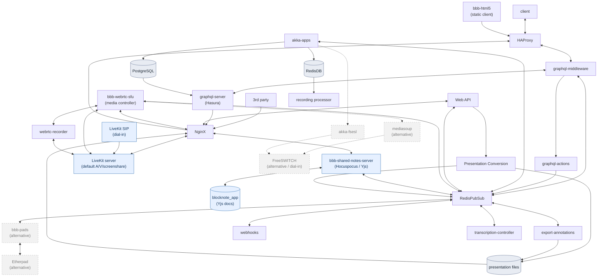
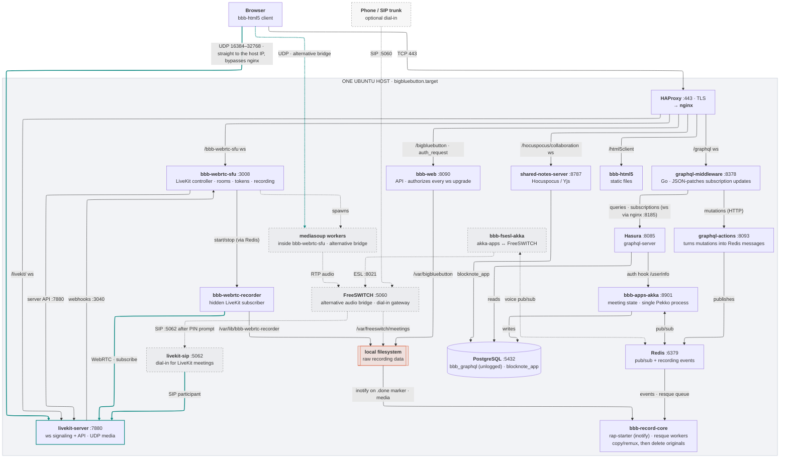

BigBlueButton is built upon a solid foundation of underlying components, including NGINX, FreeSWITCH, mediasoup, Redis, Node.js, React.js, and others.

This page describes the overall architecture of BigBlueButton and how these components work together.

## High-level architecture

The following diagram provides a high-level view of how BigBlueButton's components work together.

We'll break down each component in more detail below.

### HTML5 client

The HTML5 client is a single page, responsive web application that is built upon the following components:

- [React.js](https://facebook.github.io/react/) for rendering the user interface in an efficient manner
- [WebRTC](https://webrtc.org/) for sending/receiving audio and video
- [tl;draw](https://www.tldraw.com/) for the whiteboard
- [Apollo](https://www.apollographql.com/) graphql client
- [TypeScript](https://www.typescriptlang.org/) most of the client is written in TypeScript

The HTML5 client connects directly with the BigBlueButton server over port 443 (SSL), from loading the BigBlueButton client to making a web socket connection. These connections are all handled by nginx.

In BigBlueButton 3.0 we have performed a major architecture restructuring removing our dependency on Meteor.js and MongoDB.

### bbb-graphql-server

The `bbb-graphql-server` leverages the Hasura platform and listens on port `8085`. It handles GraphQL queries and subscriptions from clients, checks user permissions, and verifies if a user has access to requested content before returning the information. If it's a subscription, it will continue to update whenever new data is available.

### bbb-graphql-middleware

The `bbb-graphql-middleware` sits between the browser and the `bbb-graphql-server` service, forwarding messages back and forth. It's a Go application that listens for WebSocket connections on port `8378`. Apart from message forwarding, it reconnects to `the bbb-graphql-server` service whenever the client needs to refresh permissions and creates JSON patches to minimize data transfer by sending only the differences.

### bbb-graphql-actions

The `bbb-graphql-actions` application is written in Node.js. Whenever `bbb-graphql-middleware` receives a GraphQL mutation, it forwards it to `bbb-graphql-actions` via HTTP request on port 8093. The actions service validates the received parameters and sends a message via Redis to the Akka-apps.

### PostgreSQL

The PostgreSQL stores all GraphQL information in the database `bbb_graphql`. The `bbb-graphql-server` retrieves data from this database, while Akka-apps inserts information into it.

### HAproxy

<!-- TODO add info --->

### TURN server (coturn)

<!-- TODO add info --->

### BBB web

BigBlueButton web application is a Java-based application written in Scala. It implements the [BigBlueButton API](/development/api) and holds a copy of the meeting state.

The BigBlueButton API provides a third-party integration (such as the [BigBlueButtonBN plugin](https://moodle.org/plugins/mod_bigbluebuttonbn) for Moodle) with an endpoint to control the BigBlueButton server.

Every access to BigBlueButton comes through a front-end portal (we refer to as a third-party application). BigBlueButton integrates Moodle, Wordpress, Canvas, Sakai, MatterMost, and others (see [third-party integrations](https://bigbluebutton.org/schools/integrations/)). BigBlueButton comes with its own front-end called [Greenlight](/greenlight/v3/install). When using a learning management system (LMS) such as Moodle, teachers can set up BigBlueButton rooms within their course and students can access the rooms and their recordings.

Regardless of which front-end you use, they all use the [API](/development/api) under the hood.

### Redis PubSub

Redis PubSub provides a communication channel between different applications running on the BigBlueButton server.

### Redis DB

When a meeting is recorded, all events are stored in Redis DB. When the meeting ends, the Recording Processor will take all the recorded events as well as the different raw (PDF, WAV, FLV) files for processing.

### Apps akka

BigBlueButton Apps is the main application that pulls together the different applications to provide real-time collaboration in the meeting. It provides the list of users, chat, whiteboard, presentations in a meeting.

Below is a diagram of the different components of Apps Akka.

The meeting business logic is in the MeetingActor. This is where information about the meeting is stored and where all messages for a meeting are processed.

### FSESL akka

We have extracted out the component that integrates with FreeSWITCH into its own application. This allows others who are using voice conference systems other than
FreeSWITCH to easily create their own integration. Communication between Akka Apps and FreeSWITCH Event Socket Layer (fsels) uses messages through redis pubsub.

### FreeSWITCH

We think FreeSWITCH is an amazing piece of software for handling audio.

In BigBlueButton 4.0, LiveKit (see below) is the default voice backend; FreeSWITCH remains available as an alternative audio bridge for the HTML5 client and powers dial-in/telephony alongside LiveKit as well.
FreeSWITCH can also be [integrated with VOIP providers](/administration/customize#add-a-phone-number-to-the-conference-bridge) so that users who are not able to join using the headset will be able to call in using their phone.

### LiveKit

[LiveKit](https://livekit.io/) is the default media server, handling audio, camera video, and screen sharing through a single WebRTC SFU. It replaces the mixed FreeSWITCH (audio) plus mediasoup (video) topology with a unified stack. The LiveKit controller module in bbb-webrtc-sfu performs token generation, permission handling, webhook processing, and bbb-webrtc-recorder (capture) orchestration.

### Mediasoup and WebRTC-SFU

Mediasoup is a media server that implements an SFU model. It remains available as an alternative media bridge for streaming of webcams, listen-only audio, and screensharing. The WebRTC-SFU acts as the media controller handling negotiations and to manage the media streams.

### Joining a voice conference

A user can join the voice conference (handled by LiveKit by default, or by FreeSWITCH when configured and for dial-in) from the BigBlueButton HTML5 client or through the [phone](/administration/customize#add-a-phone-number-to-the-conference-bridge). When joining through the client, the user can choose to join Microphone or Listen Only, and the BigBlueButton client will make an audio connection to the server via WebRTC. WebRTC provides the user with high-quality audio with lower delay.

### Uploading a presentation

Uploaded presentations go through a conversion process in order to be displayed inside the client. When the uploaded presentation is an Office document, it needs to be converted into PDF using LibreOffice. The PDF document is then converted into scalable vector graphics (SVG) via `bbb-web`.

The conversion process sends progress messages to the client through the Redis pubsub.

### Presentation conversion flow

The diagram below describes the flow of the presentation conversion. We take in consideration the configuration for enabling and disabling SWF, SVG and PNG conversion.

Then below the SVG conversion flow. It covers the conversion fallback. Sometimes we detect that the generated SVG file is heavy to load by the browser, we use the fallback to put a rasterized image inside the SVG file and make its loading light for the browser.

### Internal network connections

The following diagram shows how the various components of BigBlueButton connect to each other via sockets. Teal lines carry media. Dashed boxes and lines are alternative or opt-in paths (the FreeSWITCH and mediasoup bridges, and telephone dial-in): those services are installed on every server but only carry traffic when that path is in use. The orange box is the local disk that `bbb-record-core` collects raw recording data from.

Besides the links drawn above, `bbb-web`, `bbb-graphql-middleware`, `bbb-webrtc-sfu` and `bbb-shared-notes-server` also exchange messages with `bbb-apps-akka` over Redis pub/sub. Those links are left out to keep the diagram readable.
