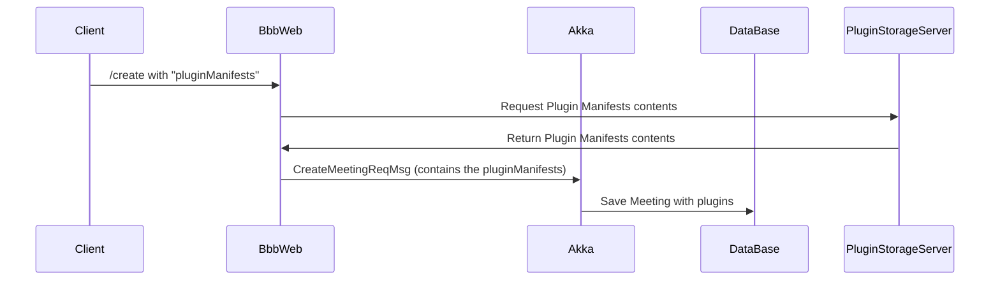
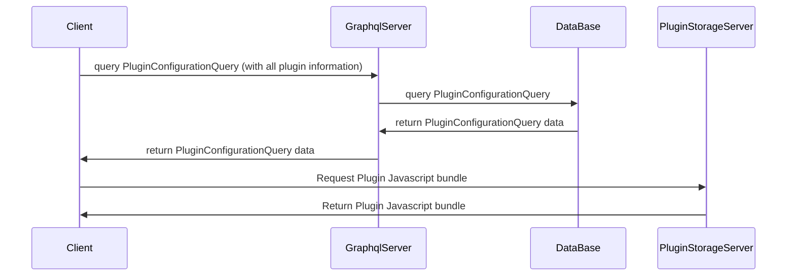

# BigBlueButton Plugins

Welcome to the official documentation for BigBlueButton Plugins.

This guide covers a wide range of topics related to plugin development, including:

- How plugins work within the BigBlueButton system;
- How to build your first plugin (with a simple “Hello World” example);
- Detailed documentation on the various APIs available for interacting with meetings;

...and much more.

Let’s get started!

## Usage

This is a general instruction on how to use a plugin.
For a detailed configuration example of each use case,
have a look at the READMEs in the respective [samples](samples)-folders.

### Running the Plugin from Source

For development purposes you can run a plugin locally from source.

For example if you take the [`sample-action-button-dropdown-plugin`](samples/sample-action-button-dropdown-plugin),
you do the following:

*Running from source code with local BBB-server*

1. Start the development server:

   ```bash
   cd $HOME/src/bigbluebutton-html-plugin-sdk/samples/sample-action-button-dropdown-plugin
   npm install
   npm start
   ```

2. Add reference to it on BigBlueButton's `/create` call or add it on `/etc/bigbluebutton/bbb-web.properties`:

```
pluginManifests=[{"url": "http://<your-URL>/manifest.json"}]
```

*Reminder:* Don't use the `localhost` URL that the `npm start` will create for you, Akka will not be able to access your manifest files this way (even if you are developing with a local bbb-docker environment). Therefore, what we recommend is to follow instructions on the next section to test the plugin as if it is in a remote BBB server (heads up: you'll be using NGROK).

*Running from source code with a remote BBB-server*

If you are running your BBB-server elsewhere, than you can't simply point the manifest URL to a local address, you'll need to either serve the built version into a CDN or serve the dev version using a service to make it public. And for the second option we'd recommend NGROK. Here are the instructions to do that:

1. Create an account on https://ngrok.com/ (Official website of NGROK);

2. Install NGROK in your computer. They have a guide for that right after you created your account;

3. Start the Plugin development server:

```bash
cd $HOME/src/plugin-pick-random-user-plugin
npm install
npm start
```

4. Start the NGROK server into your machine with the following command:

```bash
ngrok http http://172.17.0.1:4701
```

Make sure to point NGROK to the correct local URL (In our case - The samples are made this way, for instance - we used `http://172.17.0.1:4701`)

Right after that, NGROK will create an interface into your terminal and will display the URL which your static files are being served.

Here's an example of URL: `https://<uuid>.ngrok-free.app`

You can already interact with this URL and access both 

`https://<uuid>.ngrok-free.app/manifest.json`

or

`https://<uuid>.ngrok-free.app/PickRandomUserPlugin.js`


5. Add this create parameter into the API-mate of the server you are testing it on:

```
pluginManifests=[{"url": "https://<uuid>.ngrok-free.app/manifest.json"}]
```

And there you go, you can test it freely.

### Building the Plugin (Production)

To build a plugin for production use
(again, using the example of [`sample-action-button-dropdown-plugin`](samples/sample-action-button-dropdown-plugin)),
follow these steps:

```bash
cd $HOME/src/bigbluebutton-html-plugin-sdk/samples/sample-action-button-dropdown-plugin
npm ci
npm run build-bundle
```

The above command will generate the `dist` folder, containing the bundled JavaScript file named `SampleActionButtonDropdownPlugin.js` along with the `manifest.json`.
These files can be hosted on any HTTPS server.

To use the plugin with BigBlueButton, add the plugin's `manifest.json` URL to `bigbluebutton.properties` or you can simply send it via `/create` parameter:

```
pluginManifests=[{"url":"<your-domain>/path/to/manifest.json"}]
```

#### Hosting the Plugin on a BBB Server

While the plugin can be hosted on any Server, it is also possible to host the bundled file directly on
a BigBlueButton server. For that you copy `dist/SampleActionButtonDropdownPlugin.js` and `dist/manifest.json` to the folder `/var/www/bigbluebutton-default/assets/plugins/sampleActionButtonDropdownPlugin`.
In this case, the your manifest URL will be `https://<your-host>/plugins/sampleActionButtonDropdownPlugin/manifest.json`.

### Comments

#### Ways to load a plugin into a meeting

As described in earlier sections, there are several ways to load a plugin into a meeting:

- `/create` parameter `pluginManifests` – Applies only to the meeting being created. You must explicitly list the plugins in the request.
- `/create` parameter `pluginManifestsFetchUrl` – Also applies only to the meeting being created, but instead of listing plugins directly, you provide a URL that returns the plugin manifest list. This helps reduce the size of the `/create` request.
- `pluginManifests` in `/etc/bigbluebutton/bbb-web.properties` – Applies globally to all meetings on the server.

All plugin sources are combined into a single list with duplicates removed. This means plugins are merged, not overridden.

#### Using Placeholders in Plugin URLs

You can use placeholders in the plugin URLs defined in any of the previously mentioned configurations. Currently, the only supported placeholder is:

- `%%HTML5_PLUGIN_SDK_VERSION%%` – This will be automatically replaced by the version of the `bigbluebutton-html-plugin-sdk` used by `bigbluebutton-html5`.
- `%%BBB_VERSION%%` – This will be automatically replaced by the complete BigBlueButton server version (e.g.: `3.0.6`) from which the URL is called.
- `%%MEETING_ID%%` – This will be automatically replaced by the external meeting ID.

This is useful for referencing versioned plugin files without hardcoding the SDK version.

Examples:

```properties
pluginManifests=[{"url":"https://my-cdn.com/%%HTML5_PLUGIN_SDK_VERSION%%/pick-random-user/manifest.json"}]
```

Or

```properties
pluginManifestsFetchUrl=https://my-cdn.com/%%HTML5_PLUGIN_SDK_VERSION%%/all-my-plugins/list-of-plugins.json
```

If your `bbb-html5` client uses version `0.0.79` of the bigbluebutton-html-plugin-sdk (as seen in its `package.json`):

```json
{
  "dependencies": {
    "bigbluebutton-html-plugin-sdk": "0.0.79",
  },
}
```
Then `BBB-Web` will automatically transform the URLs as follows:

```properties
pluginManifests=[{"url":"https://my-cdn.com/0.0.79/pick-random-user/manifest.json"}]
```

Or

```properties
pluginManifestsFetchUrl=https://my-cdn.com/0.0.79/all-my-plugins/list-of-plugins.json
```

`BBB-Web` will then fetch the plugin manifests using these resolved URLs.

In the future, support for additional placeholders may be added.

### Manifest Json

Here is as complete `manifest.json` example with all possible configurations:

```json
{
  "requiredSdkVersion": "~0.0.77",
  "name": "MyPlugin",
  "javascriptEntrypointUrl": "MyPlugin.js",
  "localesBaseUrl": "https://cdn.domain.com/my-plugin/", // Optional
  "dataChannels":[
    {
      "name": "public-channel",
      "pushPermission": ["moderator","presenter"], // "moderator","presenter", "all"
      "replaceOrDeletePermission": ["moderator", "creator"] // "moderator", "presenter","all", "creator"
    }
  ], // One can enable more data-channels to better organize client communication
  "eventPersistence": {
    "isEnabled": true, // By default it is not enabled
    "maximumPayloadSizeInBytes": 1024,
    "rateLimiting": {
      "messagesAllowedPerSecond": 10,
      "messagesAllowedPerMinute": 20
    }
  },
  "remoteDataSources": [
    {
      "name": "allUsers",
      "url": "${meta_pluginSettingsUserInformation}",
      "fetchMode": "onMeetingCreate", // Possible values: "onMeetingCreate", "onDemand" 
      "permissions": ["moderator", "viewer"]
    }
  ],
  "settingsSchema": [
    {
      "name": "myJson",
      "label": "myJson",
      "required": true,
      "defaultValue": {
        "abc": 123
      },
      "type": "json" // Possible values: "int", "float", "string", "boolean", "json"
    }
  ]
}
```

To better understand remote-data-sources, please, refer to [this section](#external-data-resources)

**settingsSchema:**

The settingsSchema serves two main purposes:

1. **Validation:** Ensures that all required settings are provided for a plugin. If any required setting is missing, the plugin will not load.
2. **Configuration Exposure:** Lists all available settings for the plugin, enabling external systems—such as a Learning Management System (LMS)—to present these settings to a meeting organizer. This allows the organizer to configure the plugin manually before the meeting begins.

| **Name**       | **Required** | **Description**                                                                                                |
| -------------- | ------------ | -------------------------------------------------------------------------------------------------------------- |
| `name`         | Yes          | The name of the setting as defined in the YAML file                                                            |
| `label`        | No           | A user-facing label that appears in the integration UI                                                         |
| `required`     | Yes          | Indicates whether this setting must be provided (`true` or `false`)                                            |
| `defaultValue` | No           | The default value to use if no setting is explicitly defined                                                   |
| `type`         | Yes          | The expected data type for the setting. Possible values: `"int"`, `"float"`, `"string"`, `"boolean"`, `"json"` |

**Example**

Given the `settingsSchema` defined in the `manifest.json` seen, the corresponding YAML configuration file (`/etc/bigbluebutton/bbb-html5.yml`) would look like:

```yml
public:
  plugins:
    - name: MyPlugin
      settings:
        myJson:
          abc: my123
          def: 3234
```

## Examples

You can find example implementations demonstrating how to extend and customize various parts of the BigBlueButton client in the [samples](https://github.com/bigbluebutton/bigbluebutton-html-plugin-sdk/tree/v0.0.x/samples) folder of the `bigbluebutton-html-plugin-sdk` repository.

Additionally, the [BigBlueButton plugins repository](https://github.com/bigbluebutton/plugins) provides a collection of official plugins that you can explore for inspiration.


### Building a Hello-World Plugin Example

This section will guide you through all the steps needed to create a functional plugin—or at least a solid starting point. In this example, the plugin will add an option to the **Options** dropdown menu (the three dots in the top right-hand corner of the client). When clicked, it will trigger a popup displaying the message `"hello world"`.

---

**1. Choose the Right SDK Version**

First, select the appropriate version of the `bigbluebutton-html-plugin-sdk` based on your BigBlueButton server. Refer to the section [Plugin Versioning](#plugin-versioning) for guidance. You’ll need this information later in the tutorial.

---

**2. Use the Official Plugin Template**

Start with the plugin template provided by the BigBlueButton organization, available at:

[https://github.com/bigbluebutton/plugin-template](https://github.com/bigbluebutton/plugin-template)

While it's possible to build a plugin from scratch, doing so requires specific configurations in files like `package.json` and `webpack.config.js` (if you're using Webpack), which can be tricky to get right. The official template saves time by providing all the necessary boilerplate so you can focus on writing your plugin logic.

To get started:

- Visit the template page and click the **"Use this template"** button to create your own repository under your GitHub account.


---

**3. Clone the Repository and Start Coding**

Clone your new repository locally and begin making the necessary modifications. Follow the sub-steps below:

**Set Up the Plugin Name**

- Name your plugin. For this tutorial, we’ll use `plugin-hello-world`, but you’re free to choose another name.
- Also define the PascalCase version of the name (e.g., `PluginHelloWorld`) for configuration files.

**Update Placeholders**

Replace all `<plugin-name>` placeholders in the following files:

- `package.json`
- `webpack.config.js` (use PascalCase)
- `manifest.json` (use PascalCase)

**Check SDK Version Compatibility**

Go to the [bigbluebutton-html-plugin-sdk NPM page](https://www.npmjs.com/package/bigbluebutton-html-plugin-sdk) and check which version is compatible with your BigBlueButton server.

> For example, if your server uses BigBlueButton 3.0, you might need the latest `0.0.x` version which is currently `0.0.73`.

Update your `package.json` accordingly and then run:

```bash
npm install
```

---

**Create the Plugin Component**

Create a folder and component file:

```bash
mkdir src/plugin-hello-world
touch src/plugin-hello-world/component.tsx
```

Now add the following code to `component.tsx`:

```tsx
import { BbbPluginSdk, OptionsDropdownOption, pluginLogger } from 'bigbluebutton-html-plugin-sdk';
import * as React from 'react';
import { useEffect } from 'react';

interface PluginHelloWorldProps {
  pluginUuid: string;
}

function PluginHelloWorld({ pluginUuid }: PluginHelloWorldProps): React.ReactElement {
  BbbPluginSdk.initialize(pluginUuid);
  const pluginApi = BbbPluginSdk.getPluginApi(pluginUuid);

    useEffect(() => {
      pluginApi.setOptionsDropdownItems([
        new OptionsDropdownOption({
          label: 'Click me',
          icon: 'user',
          onClick: () => {
            alert('Hello, World!');
            pluginLogger.info('Option has been clicked');
          },
        }),
      ]);
    }, []);

  return null;
}

export default PluginHelloWorld;
```

- The `useEffect` hook ensures the plugin initializes only once.
- `setOptionsDropdownItems` adds the new button to the dropdown menu.
- The `onClick` handler triggers a simple popup.

---

**4. Update `index.tsx`**

Paste the following code into your `index.tsx` file:

```tsx
import * as React from 'react';
import * as ReactDOM from 'react-dom/client';
import PluginHelloWorld from './plugin-hello-world/component';

const uuid = document.currentScript?.getAttribute('uuid') || 'root';
const pluginName = document.currentScript?.getAttribute('pluginName') || 'plugin';

const root = ReactDOM.createRoot(document.getElementById(uuid));
root.render(
  <PluginHelloWorld
    pluginUuid={uuid}
    pluginName={pluginName}
  />
);
```

---

**That’s It!**

You’ve successfully created your first plugin!

To run the plugin, choose one of the following modes:

- [Running the plugin from source (development)](#running-the-plugin-from-source)
- [Building the plugin for production](#building-the-plugin-production)

---

Feel free to reach out to us for additional information or help.

## Plugin Architecture

This section explains how plugins work in BigBlueButton, from definition to loading and execution in the client.

### What is a Plugin?

In BigBlueButton, a plugin is simply a JavaScript file that gets loaded in the user's browser.

A common question is:

> Do end users (e.g.: students) need to install anything, like a browser extension?

The answer is: **No**! The JavaScript file (plugin) is delivered to the client automatically by the server. The `bigbluebutton-html5` client loads it without requiring any action from the user.

### How the plugin is loaded?

The plugin loading process is divided into two main phases: meeting creation and client loading.

1. Meeting Creation Phase



During meeting creation:

- The client sends a request to the /create endpoint with a list of `pluginManifests`.
- `bbb-web` fetches the plugin manifests from a static plugin server storage (e.g.: S3 or internally from BBB server).
- Once fetched, it includes the manifest content in a CreateMeetingReqMsg, which is sent to Akka.
- Akka stores the plugin data in the database for that meeting.

One other way to send the `pluginManifests` list to `bbb-web` is to include it into `/etc/bigbluebutton/bbb-web.properties` as mentioned previously in the second point of [this section](#running-the-Plugin-from-Source). This way, `bbb-web` gets the it via config file and it will be applied to every meeting of this particular server (with no need to include it in every create call). Key point: if a different list is included in the create call along with the list in the properties file, they will be merged into one and carry on the flow.




As for the second part, when the user joins the meeting:

- The client issues a PluginConfigurationQuery through the GraphQL server.
- The server queries the database and returns the plugin configuration, which includes:

```gql
plugin {
  name,
  javascriptEntrypointUrl,
  javascriptEntrypointIntegrity,
  localesBaseUrl,
}
```

- Using this information, the client fetches the plugin’s JavaScript bundle from the plugin storage server and loads it into the React component tree.

### Developing the `bigbluebutton-html-plugin-sdk`

This guide explains how to contribute to the [`bigbluebutton-html-plugin-sdk`](https://github.com/bigbluebutton/bigbluebutton-html-plugin-sdk), including adding new features or fixing existing issues. It also covers how to integrate those changes with the BigBlueButton client when necessary.

---

#### 1. Determine the Scope of the Change

Before starting development, assess whether your change affects only the `plugin-sdk` repository or also requires changes to the main BigBlueButton (`bbb-html5`) repository.

As an example, let's walk through a feature that affects both: **adding a `data-test` attribute to the floating window extensible area.**

---

#### 2. Fork necessary repositories

After deciding the repositories in which the changes are needed, it is necessary to have a fork to contribute.

1. Fork the [bigbluebutton-html-plugin-sdk](https://github.com/bigbluebutton/bigbluebutton-html-plugin-sdk) repository;
2. Fork the [main bigbluebutton](https://github.com/bigbluebutton/bigbluebutton) repository;
3. Clone the forks locally;

```bash
git clone https://github.com/YourUsername/bigbluebutton-html-plugin-sdk
```

---

#### 3. Setting Up Your Environment

After having cloned both repositories cloned locally:

- `bigbluebutton-html-plugin-sdk`
- `bigbluebutton`

Create a development branch in both repositories (ideally with the same name) to keep changes organized.

---

#### 4. Make Changes in the Plugin SDK

Start by implementing the required changes in the SDK. In our example, we’ll add a new `dataTest` string property to the `FloatingWindow` component:

**File:** `src/extensible-areas/floating-window/component.ts`

```ts
export class FloatingWindow implements FloatingWindowInterface {
  id: string = '';
  type: FloatingWindowType;
  dataTest: string;

  constructor({
    id,
    dataTest,
    ...
  }: FloatingWindowProps) {
    if (id) this.id = id;
    this.dataTest = dataTest;
    ...
  }
}
```

Also update the type definition to reflect this new property:

**File:** `src/extensible-areas/floating-window/types.ts`

```ts
export interface FloatingWindowProps {
  id: string;
  dataTest: string;
  ...
}
```

---

#### 5. Publish the changes to the projects needed

To verify your change, you’ll need to test it in a sample plugin and in the BigBlueButton client.

For new features, it’s best to create a new sample plugin. However, in this example, we'll use the existing `sample-floating-window-plugin`.

Follow these steps to build and publish the SDK to both the sample plugin and `bbb-html5`:

```bash
# From the SDK root
npm install
npm run build

# Ensure dependencies are installed in both target projects
cd ~/path/to/bigbluebutton-html5
npm install
cd -

cd samples/sample-floating-window-plugin
npm install
cd -

# Publish SDK changes to both the BBB client and the sample plugin
./scripts/publish-to-project-folder.sh ~/path/to/bbb-html5
./scripts/publish-to-project-folder.sh samples/sample-floating-window-plugin
```

This ensures the changes in the SDK are applied to both the BigBlueButton client and the plugin sample.

> **Optional:** To publish the SDK to all sample plugins at once, use:
> ```bash
> ./scripts/publish-to-samples.sh
> ```

---

#### 6. Update the BigBlueButton Client (`bbb-html5`)

Now make the necessary changes to the `bigbluebutton/bigbluebutton` repository in the `bigbluebutton-html5` directory. For our example, update the following files to pass and use the new `dataTest` prop:

**File:** `imports/ui/components/floating-window/component.tsx`

```tsx
const renderComponent = (
  elementRef: React.MutableRefObject<null>,
  ...
  dataTest: string,
) => (
  <Styled.FloatingWindowContent
    ref={elementRef}
    id={key}
    data-test={dataTest}
    ...
  />
);
```

Update the container (`imports/ui/components/floating-window/container.tsx`) logic to pass `dataTest` down to the `renderComponent`.

---

#### 7. Update the Sample Plugin

After the SDK is built and published, you can update the sample plugin to use the new `dataTest` property accordingly. And test it (using the [development mode](#running-the-plugin-from-source), for example) against the BigBlueButton's client (`bigbluebutton-html5`).

---

#### 8. Submitting Pull Requests

Once all changes are complete and tested:

- Commit the changes in the `bigbluebutton-html-plugin-sdk` (all needed to run the feature/fix and the changes made to the sample);
- In the `bigbluebutton-html5` client **do not reference a version number** for the SDK in `package.json` yet. Instead, use the commit hash from your SDK changes

Example:

```json
"dependencies": {
  ...
  "bigbluebutton-html-plugin-sdk": "https://codeload.github.com/bigbluebutton/bigbluebutton-html-plugin-sdk/tar.gz/<commit-hash-id>"
}
```
 
You can get the commit hash from `git log` or directly from the commit list in your `bigbluebutton-html-plugin-sdk` pull request.

Alternatively, it is possible to reference the PR from the `bigbluebutton-html-plugin-sdk` directly. (This implies that you need to first send the PR for this repository and then the PR for `bigbluebutton/bigbluebutton`)

The resulting `package.json` would be:

```json
"dependencies": {
  ...
  "bigbluebutton-html-plugin-sdk": "https://codeload.github.com/bigbluebutton/bigbluebutton-html-plugin-sdk/tar.gz/refs/pull/<pr-number>/head"
}
```

Replace `<pr-number>` with your actual pull request number.

After adding it, run:

```bash
# From bigbluebutton-html5
npm install
```

This will update the `bigbluebutton-html5/package-lock.json` accordingly.

- Publish the branches to the origin by running `git push --set-upstream origin <branch-name>` for both repositories;
- Submit a **separate pull request for each repository** (`bigbluebutton-html-plugin-sdk` and `bigbluebutton`).

---

#### 9. Finalizing with an Official SDK Version

Once your PRs are approved:

1. The maintainers will merge the SDK PR first.
2. A new version will be published to [npmjs.com](https://npmjs.com) (e.g.: `0.0.99`).
3. You’ll then update the `package.json` in `bigbluebutton-html5` to use the official version:

```json
"dependencies": {
  ...
  "bigbluebutton-html-plugin-sdk": "0.0.99"
}
```

4. Run:

```bash
npm install
```

5. Finally, update the SDK version in the following file in the `bigbluebutton-web` project:

**File:** `bigbluebutton-web/grails-app/conf/bigbluebutton.properties`

```properties
html5PluginSdkVersion=0.0.99
```

---

6. Now you stage these last changes, likely, those will be just:

```
bigbluebutton-web/grails-app/conf/bigbluebutton.properties
bigbluebutton-html5/package.json
bigbluebutton-html5/package-lock.json
```

7. Commit the staged changes and push to origin to update the `bigbluebutton/bigbluebutton` PR.

With that, your feature or fix will be ready for release. 🎉

## API

### Extensible UI areas

Foreach of the following ui-extensible-area, we have a different setter function accessible via `pluginApi`.

Mind that, although each area has its own structure, all the functions follows a certain argument structure, and returns nothing, that would be:

```ts
pluginApi.setterFunctionExample([{
  objectProperty1: 'string',
  objectProperty2: 123,
}])
```

See, it is basically a function that requires an array as an argument, with which the more items you push to that array, the more of that extensible area you will have.

That being said, here are the extensible areas we have so far:

- Action bar items (button, separator)
- Action Button Dropdown Items (option, separator)
- Audio settings dropdown items (option, separator)
- Camera settings dropdown items (option, separator)
- Options settings dropdown items (option, separator)
- Nav bar items (button, info)
- Presentation dropdown items (option, separator)
- Presentation toolbar items (button, separator, spinner)
- User camera settings dropdown items (option, separator)
- User list dropdown items (option, separator)
- User list item additional information (item, label)
- Floating window item (floatingWindow)
- Generic Content (main, sidekick)
- User Camera Helper (button)
- Screenshare Helper (button)

Mind that no plugin will interfere into another's extensible area. So feel free to set whatever you need into a certain plugin with no worries.

### Auxiliary functions:

- `getSessionToken`: returns the user session token located on the user's URL.
- `getJoinUrl`: returns the join url associated with the parameters passed as an argument. Since it fetches the BigBlueButton API, this getter method is asynchronous.
- `useLocaleMessages`: returns the messages to be used in internationalization functions (recommend to use `react-intl`, as example, refer to official plugins)

### Realtime data consumption

- `useCurrentPresentation` hook: provides information regarding the current presentation;
- `useLoadedUserList` hook: provides information regarding the loaded user list (displayed in the screen);
- `useCurrentUser` hook: provides information regarding the current user;
- `useUsersBasicInfo` hook: provides information regarding all users (only crucial information: userId, name and role);
- `useLoadedChatMessages` hook: provides information regarding the loaded chat messages;
- `useCustomSubscription` hook: with this hook, the developer can query pretty much anything graphql can provide. Note: Make sure that, on BBB version change, the custom subscriptions you make will work as expected.
- `usePluginSettings` hook: it provides all the specific settings regarding the current plugin it's been loaded from.
- `useTalkingIndicator` hook: it gives you information on the user-voice data, that is, who is talking or muted.
- `useMeeting` hook: it gives you information on the current meeting that the user is on.

So for these types of hooks, the return will follow the same structure:

```ts
export interface GraphqlResponseWrapper<TData> {
  loading: boolean;
  data?: TData;
  error?: ApolloError;
}
```

So we have the `data`, which is different for each hook, that's why it's a generic, the error, that will be set if, and only if, there is an error, otherwise it is undefined, and loading, which tells the developer if the query is still loading (being fetched) or not.

### Real time data exchange

- `useDataChannel` hook: this will allow you to exchange information (Send and receive) amongst different users through the same plugin;

So for this hook to read the data from the data channel, the developer will be able to choose the format in which they want it.The possible formats are described down below:

- ALL_ITEMS: Fetches all items from specific data-channel and specific subchannel-name since the beginning of the meeting from the newest to the latest (It can be used as a history);
- LATEST_ITEM: Fetches only the latest item pushed to the data-channel within a specific subchannel-name since the beginning of the meeting;
- NEW_ITEMS: Fetches the new items pushed to the data-channel within a specific subchannel-name since the moment that the `useDataChannel` hook has been called (It will not see entries sent previous to that moment);

An interesting thing about this hook is that it is generic, so, you can use a custom type, and this will be  found not only in the consumer part of the data structure returned, but also in functions in which you need to specify an object to be persisted, meaning it will force the object to be of the type you mentioned previously (that is the case for `pushEntry` and `replaceEntry`). One can find examples of usage of this in the data-channel plugin sample or most of the official ones. The syntax is described below:

```typescript
const {
  data: response, // Data that will be returned
  pushEntry: pushEntryFunction, // Function to push another item to the data-channel
  deleteEntry: deleteEntryFunction, // Function to delete specific item or wipe all
  replaceEntry: replaceEntryFunction, // Function replace a specific item
} = useDataChannel<CustomType>(
  channelName, // Defined according to what is on manifest.json
  DataChannelTypes.ALL_ITEMS, // | LATEST_ITEM | NEW_ITEMS -> ALL_ITEMS is default
  subChannelName = 'default', // If no subchannelName is specified, it will be 'default'
);
```

Wiping all data off will delete every item from the specific data-channel within the specific subchannel-name.

**Data-channel configuration:**

The data-channel name must be in the `manifest.json` along with all the permissions for writing (pushPermission), updating and deleting (replaceOrDeletePermission), see example below:

```json
{
  "requiredSdkVersion": "~0.0.59",
  "name": "PluginName",
  "javascriptEntrypointUrl": "PluginName.js",
  "dataChannels":[
    {
      "name": "channel-name",
      "pushPermission": ["moderator","presenter"],
      "replaceOrDeletePermission": ["moderator", "sender"]
    }
  ]
}
``` 

If no permission is mentioned in that file (writing or deleting), no one will be able proceed with that specific action:

The `pushEntryFunction` has a minor detail to pay attention to, it is possible to specify the users who you want to send the item to, if none is specified, all will receive the item, such as done ahead:

```typescript
pushEntryFunction(objectToBePushed: T, options: {
  receivers?: ObjectTo[];
})
export interface ToUserId {
  userId: string;
}
export interface ToRole {
  role: DataChannelPushEntryFunctionUserRole;
}

export type ObjectTo = ToUserId | ToRole;
```

### Real time ui data consumption

- `useUiData` hook: This will return certain data from the UI depending on the parameter the developer uses. It works just like the useUiEvent hook, but instead of passing a callback as a parameter to be run every time the event occurs, it will return the data directly, keep in mind that the second parameter is the default value that this function will assume. Possible choices:
  - IntlLocaleUiDataNames.CURRENT_LOCALE;
  - ChatFormUiDataNames.CURRENT_CHAT_INPUT_TEXT;
  - ChatFormUiDataNames.CHAT_INPUT_IS_FOCUSED;
  - ExternalVideoVolumeUiDataNames.CURRENT_VOLUME_VALUE;
  - ExternalVideoVolumeUiDataNames.IS_VOLUME_MUTED;
  - UserListUiDataNames.USER_LIST_IS_OPEN;
  - LayoutPresentationAreaUiDataNames.CURRENT_ELEMENT;

Example of usage:

```ts
  const currentLocale = pluginApi.useUiData(IntlLocaleUiDataNames.CURRENT_LOCALE, {
    locale: 'en',
    fallbackLocale: 'en',
  });
  // Do something with the currentLocale:
  currentLocale.locale;
  currentLocale.fallbackLocale;

```

Mind that foreach enum we have, a different type of fallback is needed as the second argument. In the example above, we want the `intl`, so the second argument, will follow the structure depicted.

One other thing is that the type of the return is precisely the same type required as the second argument.

### Fetch ui data on demand

- `getUiData` async function: This will return certain data from the UI depending on the parameter the developer uses. Unlike the `useUiData` this function does not return real-time information as it changes. See the currently supported:
  - PresentationWhiteboardUiDataNames.CURRENT_PAGE_SNAPSHOT;

Example of usage:

```ts
  const { pngBase64 } = pluginApi.getUiData(
    PresentationWhiteboardUiDataNames.CURRENT_PAGE_SNAPSHOT,
  );
  // Do something with the currentLocale:
  console.log('This is an example fetching the base64 PNG', pngBase64);

```

As seen for the `useUiData`, the return type is well defined by the enum chosen (in other words, name of the ui-data). So I encourage you to take a look into the previous section to know more about it.

### Ui Commands to automatize tasks in BBB

`uiCommands` object: It basically contains all the possible commands available to the developer to interact with the core BBB UI, see the ones implemented down below:

- chat:
  - form:
    - open: this function will open the sidebar chat panel automatically;
    - fill: this function will fill the form input field of the chat passed in the argument as `{text: string}`
- external-video:
  - volume:
    - set: this function will set the external video volume to a certain number between 0 and 1 (that is 0% and);
- sidekick-options-container:
  - open: this function will open the sidekick options panel automatically;
  - close: this function will close the sidekick options panel automatically (and also the sidebar content if open, to avoid inconsistencies in ui);
- presentation-area:
  - open: this function will open the presentation area content automatically;
  - close: this function will close the presentation area content automatically;
- conference:
  - setSpeakerLevel: this function will set the speaker volume level(audio output) of the conference to a certain number between 0 and 1;
- notification:
  - send: This function will send a notification for the client to render, keep in mind that it's only client-side. Should you want it to be rendered in multiple clients, use this with a data-channel;
- user-status:
  - setAwayStatus: this function will set the away status of the user to a certain status;

See usage ahead:

```ts
  pluginApi.uiCommands.chat.form.open();
  pluginApi.uiCommands.chat.form.fill({
    text: 'Just an example message filled by the plugin',
  });
```

So the idea is that we have a `uiCommands` object and at a point, there will be the command to do the intended action, such as open the chat form and/or fill it, as demonstrated above

### Server Commands
  
  `serverCommands` object: It contains all the possible commands available to the developer to interact with the BBB core server, see the ones implemented down below:
  
  - chat:
    - sendPublicMessage: This function sends a message to the public chat on behalf of the currently logged-in user.

    - sendCustomPublicMessage: This function sends a text message to the public chat, optionally including custom metadata.
      > **Note**: The custom messages sent by plugins are not automatically rendered by the client. To display these messages, a plugin must handle the rendering using `useLoadedChatMessages` and `useChatMessageDomElements`.

  - caption:
    - save: this function saves the given text, locale and caption type
    - addLocale: this function sends a locale to be added to the available options

### Dom Element Manipulation

- `useChatMessageDomElements` hook: This hook will return the dom element of a chat message reactively, so one can modify whatever is inside, such as text, css, js, etc.;
- `useUserCameraDomElements` hook: This hook will return the dom element of each of the user's webcam corresponding to the streamIds passed reactively, so one can modify whatever is inside, such as text, css, js, etc., and also can get the video element within it;

### Learning Analytics Dashboard integration

- `sendGenericDataForLearningAnalyticsDashboard`: This function will send data for the bbb to render inside the plugin's table

The object structure of this function's argument must be:

```ts
interface GenericDataForLearningAnalyticsDashboard {
  cardTitle: string; // Yet to be implemented (future updates)
  columnTitle: string;
  value: string;
}
```

So that the data will appear in the following form:

|   User    | Count | `<columnTitle>` |
|    ---    |  :--  |      --:        |
| user-name |   1   |   `<value>`     |


### External data resources

This is the new integration with external servers to fetch data in a secure manner.

This is possible by simply configuring the dataResource name in the manifest and then its endpoint in the URL meta parameter that goes in the create request. The manifest would look like:

```json
{
  // ...rest of manifest configuration
  "remoteDataSources": [
      {
          "name": "allUsers",
          "url": "${meta_pluginSettingsUserInformation}",
          "fetchMode": "onMeetingCreate", // Possible values: "onMeetingCreate", "onDemand" 
          "permissions": ["moderator", "viewer"] // Possible values: "moderator", "viewer", "presenter"
      }
  ]
}
```

Going through each parameter to better understand it's structure:

- `name`: It is the name of the remote data source, that is the name you'll use later on in the plugin when developing it;
- `url`: The Url to which the data will be fetched (it can be hard-coded in the `manifest.json`, but we recommend passing it as a `meta_` parameter);
- `fetchMode`: It tells the plugin-server if it should fetch the data only when creating the meeting, or every time the function is called in the plugin portion;
  - If one chooses `onMeetingCreate`, the data will be fetched when the create endpoint of the meeting is called, then it's cached in the plugin-server so that every time the plugin wants that data, the plugin-server will respond with the cached data;
  - On the other hand, if `onDemand` is selected, every time the plugin calls this method, the plugin-server will fetch the data and then proxy it to the plugin;
- `permissions`: This tells the back-end which role of the meeting can access this remote data;

Here is the `/create` parameters you would have to pass to make this remote-data-source api work:

```
meta_pluginSettingsUserInformation=https://<your-external-source-with-your-authentication>/api/users
pluginManifests=[{"url": "http://<domain-of-your-manifest>/your-plugin/manifest.json"}]
```

See that we send the `meta_` parameter, for more information, refer to the [meta parameters section](#meta_-parameters)

Lastly, in the plugin, just use the function like:

```typescript
pluginApi.getRemoteData('allUsers').then((response: Response) => {
  if (response.ok) {
    response.json().then((r: CourseData) => {
      // Do something with the jsonified data (if it's a json)
    }).catch((reason) => {
      pluginLogger.error('Error while processing the json from success response: ', reason);
    });
  }
}).catch((reason) => {
  pluginLogger.error('Error while fetching external resource: ', reason);
});
```

### Customize manifest.json

The following sections explain how you can dynamically customize your manifest.json for different runs.

#### Meta_ parameters

This is not part of the API, but it's a way of passing information to the manifest. Any value can be passed like this, one just needs to put something like `${meta_nameOfParameter}` in a specific config of the manifest, and in the `/create` call, set this meta-parameter to whatever is preferred, like `meta_nameOfParameter="Sample message"`

This feature is mainly used for security purposes, see [external data section](#external-data-resources). But can be used for customization reasons as well.

#### Plugin_ parameters

`plugin_` parameters work similarly to `meta_` parameters, allowing data to be passed dynamically to the manifest. While they can serve the same purposes — like security or customization — they are specifically scoped to individual plugins.

**Format:**

```
plugin_<pluginName>_<parameter-name>
```

- `<pluginName>` — The name of the plugin as defined in `manifest.json`.  
- `<parameter-name>` — The parameter's name. It may include letters (uppercase or lowercase), numbers and hyphens (`-`).

This naming convention ensures that each plugin has its own namespace for parameters. Other plugins cannot access values outside their own namespace. For example:

```
plugin_pickRandomUserPlugin_url-to-fetch-data=https://...
```

This isolates the parameter to `pickRandomUserPlugin` and avoids conflicts with other plugins.

#### Default value (fallback) for missing placeholder's parameters

If a plugin expects a placeholder (via `meta_ `or `plugin_`) but doesn't receive a value, the plugin will fail to load. To prevent this, both types of placeholders support default values. This allows the system administrator to define fallback values, ensuring the plugin loads correctly.

**Example with a default value (`manifest.json`):**
```json
{
  "requiredSdkVersion": "~0.0.77",
  "name": "MyPlugin",
  "javascriptEntrypointUrl": "MyPlugin.js",
  "localesBaseUrl": "https://cdn.domain.com/my-plugin/", // Optional
  "dataChannels":[
    {
      "name": "${plugin_MyPlugin_data-channel-name:storeState}",
      "pushPermission": ["moderator","presenter"], // "moderator","presenter", "all"
      "replaceOrDeletePermission": ["moderator", "creator"] // "moderator", "presenter","all", "creator"
    }
  ]
}
```

In this example, if the parameter `plugin_MyPlugin_data-channel-name` is not provided during the `/create` call, it will fall back to "storeState".

### Event persistence

This feature will allow the developer to save an information (which is basically an event) in the `event.xml` file of the meeting if it's being recorded.

To use it, one first need to add the following lines to their `manifest.json`:

```json
{
  // ...rest of manifest configuration
  "eventPersistence": {
      "isEnabled": true,
      "maximumPayloadSizeInBytes": 1024,
      "rateLimiting": {
          "messagesAllowedPerSecond": 10,
          "messagesAllowedPerMinute": 20
      }
  }
}
```

Then, the API in the SDK for that is:

```ts
pluginApi.persistEvent(eventName: string, payloadJson: Object);
```

See example in the `sample-use-meeting` plugin here in this repository. It is as follows:

```ts
useEffect(() => {
    setInterval(() => {
      pluginLogger.info('persisting event');
      pluginApi.persistEvent('eventFromUseMeetingSample', { foo: 'bar' });
    }, 5000);
  }, []);
```

After the meeting is ended (considering it has been recorded), one can simply do the following steps to see the events:

In the server terminal run:
```bash
sudo updatedb
vi $(locate events.xml | grep <meeting-id>)
```

Where `<meeting-id>` is the id of the the meeting you just recorded. Then, amongst all the other events in the file, if you search it, you will find the following:

```xml
<event timestamp="25004947" module="PLUGIN" eventname="PluginGeneratedEvent">
  <payloadJson>{"foo":"bar"}</payloadJson>
  <pluginEventName>eventFromUseMeetingSample</pluginEventName>
  <date>2024-10-30T18:00:11.929Z</date>
  <pluginName>SampleUseMeeting</pluginName>
  <userId>w_sxlfjbcb0yxs</userId>
  <timestampUTC>1730311211929</timestampUTC>
</event>
```

## Frequently Asked Questions (FAQ)

**How do I remove a certain extensible area that I don't want anymore?**
It is pretty simple: just set an empty array of elements of that specific extensible area.
Or simply remove the specific item of the array and set the new array to that extensible area in the next iteration.

See example below:

```ts
// First iteration:
  // Define both variables:
  const dropdownToUserListItem = { ... };
  const buttonToUserListItem = { ... };
  pluginApi.setActionsBarItems([dropdownToUserListItem, buttonToUserListItem]);

// Second iteration:
  // Redefine variable(s):
  const newButtonToUserListItem = { ... };
  pluginApi.setActionsBarItems([newButtonToUserListItem]);

// Third iteration:
  // I don't want any of this extensible-area:
  pluginApi.setActionsBarItems([]);
  // All set from this plugin will disappear from the UI;
```

**How to properly build a plugin?**
Just go to your plugin folder, install dependencies and run the build command as follows:

```bash
cd my-plugin-folder/
npm i
npm run build-bundle
```

At this point, another folder will be created into the plugin directory called "dist/" inside of that folder you will find the plugin itself `MyPlugin.js`. Remember that the name of this file will be the same as defined in the `webpack.config.js`, such as:

```js
module.exports = {
  // ... Other configurations
  output: {
    filename: 'MyPlugin.js'
  }
  // ... Other configurations
}
```

**Does the builded plugin need to be in the same BBB server?**
No, feel free to host it anywhere you want, just make sure to point the URL from `manifest.json` correctly (into the create endpoint or `bigbluebutton.properties`).

**I am making my plugin based on a sample inside the SDK, but somehow, the sample is not working properly, what do I do to run it in dev mode and make it work?**
Well there are several motives to why the sample is not working properly, so I will go through each one of them briefly:

- The config has not been set properly in `manifest.json`, see [this section to configure your plugin](#running-the-plugin-from-source);
- The plugin is not even running in dev mode, it could be the port already in use, or typescript and/or javascript errors (Make sure to initialize the `pluginApi` as any of the samples inside a react function component);
- It could be an error with that sample indeed, or that feature the plugin uses broke (it is not usual, but can happen since BBB is constantly changing and enhancing its features with its wonderful community). If that happens, just open an issue in the [SDK&#39;s github](https://github.com/bigbluebutton/bigbluebutton-html-plugin-sdk) detailing the error you are facing. And thank you in advance for reporting it back to us so we can improve each time.

**How to troubleshoot the plugins? See if it has loaded in the BBB, for instance.**
Well, each time a set of plugins listed to be run into a specific meeting start, it will fire some logs based on the amount of plugins that it need to load inside the client. So open the console in the browser by pressing F12 key in your keyboard and search for the following log:

```log
<ratio of loaded plugins> plugins loaded
```

If 1 out of 5 plugins loaded, you'll see "1/5 plugins loaded", and so on.

Also, when a plugin loaded, the client will log it's name like:

```log
Loaded plugin MyPlugin
```

Sometimes, there could be the case of a plugin to not load properly and an error will log with the following message:

```log
Error when loading plugin MyPlugin, error:  {"isTrusted":true}
```

In this case, the URL that leads to the plugin is not available or leads to an error. But it can log something different, so pay attention to what the error message will tell you.

Lastly, there are, of course, other scenarios and different informative logs, but these are the most common and important ones. Please contact us if you feel we left something out!
